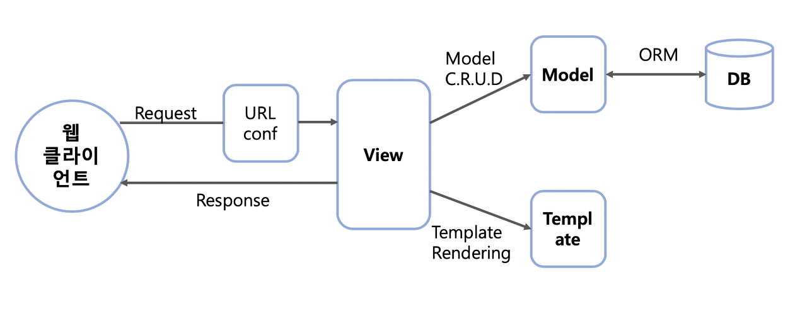
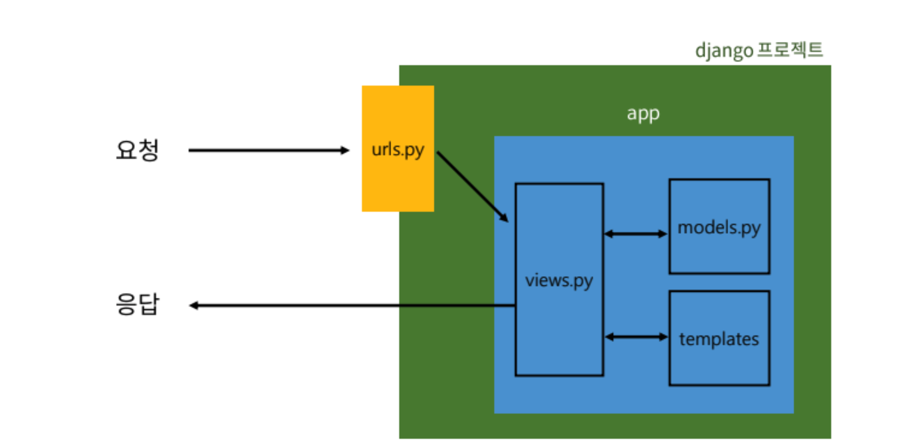
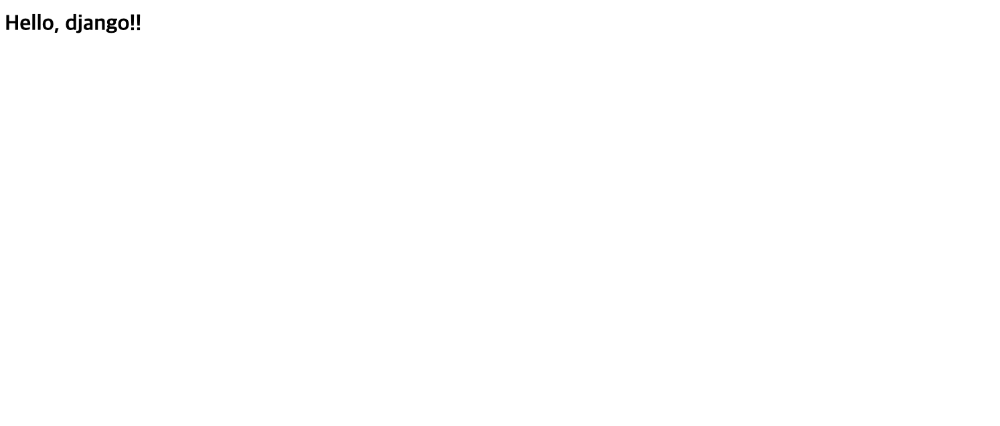

# 장고 앱 등록
## app 생성

```py
python manage.py startapp articles
# 앱이름은 복수형으로 
```
## app 등록
```py
# 프로젝트의 settings.py 에서 앱 이름 추가
INSTALLED_APPS = [
    # app 등록 권장 순서
    # 1. locl app
    'articles',
    # 2. 3rd party app (설치를 통해 추가하는 앱)
    # 3. 기본 장고 app
    'django.contrib.admin',
    'django.contrib.auth',
    'django.contrib.contenttypes',
    'django.contrib.sessions',
    'django.contrib.messages',
    'django.contrib.staticfiles',
]
```
# 프로젝트와 앱의 구조
## 프로젝트 구조 
- \_\_init\_\_.py
    - 해당 폴더를 패키지로 인식하게 하는 역할
- asgi.py 
    - 비동기식 웹 서버와의 연결 관련 설정
- settings.py
    - 프로젝트의 모든 설정을 관리
- urls.py
    - URL과 이에 해당하는 적절한 views를 연결
- wsgi.py 
    - 웹 서버와의 연결 관련 설정
- manage.py 
    - 위 파일들과는 다르게 프로젝트 밖에 있는 파일
    - Djago 프로젝트와 다양한 방법으로 상호작용 하는 커맨드라인 유틸리티
----------
## 앱의 구조
- \_\_init\_\_.py
    - 해당 폴더를 패키지로 인식하게 하는 역할
- admin.py
    - 관리자용 페이지 설정
- apps.py
    - 앱의 정보가 작성된 곳
- models.py
    - DB와 관련된 Model을 정의
- tests.py
    - 프로젝트 테스트 코드를 작성하는 곳
- views.py
    - HTTP 요청을 처리하고 해당 요청에 대한 응답을 반환<br>
    (url, mode, template과 연계)
# 장고의 디자인 패턴
## MTV 디자인 패턴
- Model
- Template
- View




# 요청과 응답
## 1. URLs
```py
#urls.py
from django.contrib import admin
from django.urls import path
from articles import views

urlpatterns = [
    path('admin/', admin.site.urls),
    path('articles/', views.index), # 이 부분 추가
                    # views 모듈의 index 함수 호출
]
```
## 2. Views
```py
from django.shortcuts import render

# Create your views here.
# 필수로 request 라고 인자를 쓴다
def index(request):
    return render(request, 'index.html')
    # render(request, template_name, context)
    # request :요청객체(항상 request)
    # template_name :탬플릿의 이름 경로 (문자열로 작성, app 폴더 안에 항상 templates라는 폴더 생성 후 그 안에 생성)
    # context : 템플릿에서 사용할 데이터 (딕셔너리 타입으로 작성)
```
## 3. Templates
- 보여지고 싶은 html 파일 작성

