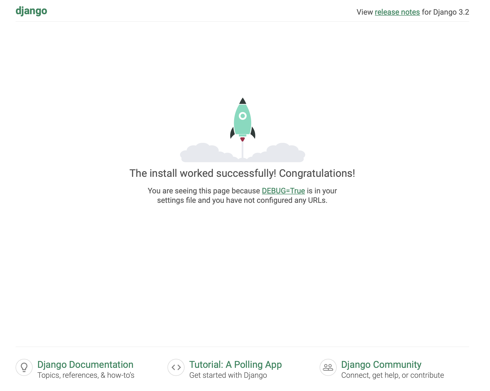

# 가상환경과 Django 시작하기


## 1. 가상환경 생성
```bash
python -m venv venv
```
## 2. 가상환경 활성화
```bash
#venv가 있는 위치에서 실행

#window
source venv/Scripts/activate
#mac
source venv/bin/activate
```
## 3. django 설치
```bash
pip install django==3.2.18

# 2023년 3월 기준 
# django LTS 버전 3.2.18
```
## 4-1. 의존성 파일 생성
```bash
pip freeze > requirements.txt

# 패키지 설치시마다 실행
```
## 4-2. 의존성 파일을 이용한 패키지 설치
```bash
pip install -r requirements.txt
```
## 5. .gitignore 파일 생성
[.gitignore](https://www.toptal.com/developers/gitignore) 파일 생성해주는 사이트

## 6. git 환경 조성

## 7. django 프로젝트 생성
```bash
django-admin startproject fristpjt .

# firstpjt 이름 
# . 현재 위치에 생성
```
## 8. 장고 실행
```bash
python manage.py runserver

# 프로젝트와 가상환경이 같이 있는 위치인지 확인
```
서버 링크를 눌러 화면 확인


화면이 나오면 성공
 